# CPAC SB&M Inventory Management — System Flow ปัจจุบัน

เอกสารนี้สรุปจากพฤติกรรมของระบบและ API ที่อยู่ในโค้ดปัจจุบัน เพื่อใช้ทำสไลด์ อธิบายระบบ และพูดนำเสนอหน้าเวที

> ขอบเขตสำคัญ: ระบบใช้ `transactions` เป็นแหล่งคำนวณสต๊อกที่ใช้งานจริง โดยหนึ่งใบเบิกอาจมีหลายแถวตามสินค้าและล็อต แต่ทุกแถวจะถูกรวมเป็นใบเดียวกันด้วย `issueKey`

## 1. ภาพรวมระบบ

**CPAC SB&M Inventory Management** เป็นระบบบริหารสินค้าในคลังและใบเบิก ตั้งแต่ข้อมูลหลักสินค้า รับสินค้าเข้า สร้างใบเบิก อนุมัติ จ่ายสินค้า ยืนยันรับ ปิดใบเบิก ส่งอีเมลแจ้งเตือน และพิมพ์เอกสารใบเบิก

ข้อมูลไหลผ่านระบบตามลำดับหลักดังนี้

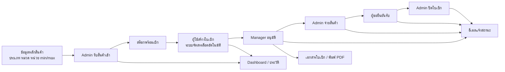

บทบาทหลักในระบบมี 3 บทบาท

| บทบาท | หน้าที่และขอบเขตจริง |
| --- | --- |
| `Employee` | สร้างใบเบิก ติดตามใบที่ตนเป็นผู้ขอหรือคนคีย์ ยกเลิกใบของตนขณะยัง `pending` และยืนยันรับสินค้าเมื่อเป็นผู้ขอในใบนั้น |
| `Manager` | สร้างใบเบิกได้ ดู Dashboard/ข้อมูลที่สิทธิ์เข้าถึง ตรวจและอนุมัติเฉพาะใบที่ระบุชื่อตนเป็นผู้อนุมัติ และติดตามใบที่ตนเป็นผู้ขอ คนคีย์ หรือผู้อนุมัติ |
| `Admin` | เห็นธุรกรรมทั้งหมด จัดการข้อมูลสินค้า/ผู้ใช้ รับเข้า จ่ายสินค้า ปิดใบเบิก ยกเลิกใบที่ยัง `pending` ดู Dashboard ทั้งคลัง และเปิดเอกสารใบเบิก |

เมนูตามหน้าจอปัจจุบัน

| เมนู | Employee | Manager | Admin |
| --- | :---: | :---: | :---: |
| เลือกสินค้าเพื่อเบิก | ✓ | ✓ | ✓ |
| ใบเบิกของฉัน / อนุมัติใบเบิก / จัดการใบเบิก | เฉพาะที่เกี่ยวข้อง | เฉพาะที่เกี่ยวข้อง | ทุกใบ |
| Dashboard | – | ✓ ตามข้อมูลที่สิทธิ์เห็น | ✓ ทั้งคลัง |
| คลังสินค้าและรับเข้า | – | – | ✓ |
| สินค้าใกล้หมด/หมดอายุ | – | ✓ | ✓ |
| ผู้ใช้และบทบาท | – | – | ✓ |
| ตั้งค่ารายการสินค้า | – | – | ✓ |

## 2. Flow รวมทั้งระบบ

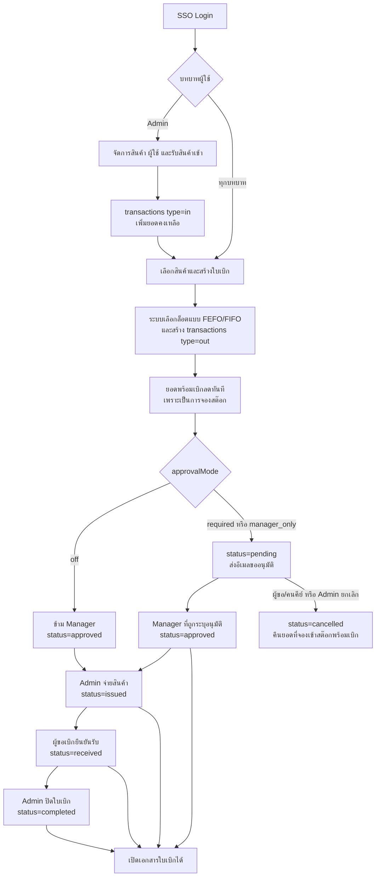

หลักการคำนวณสต๊อกที่ควรพูดให้ชัด

- `type=in` เพิ่มยอดคงเหลือ
- `type=out` ทุกสถานะตั้งแต่ `pending` เป็นต้นไปลด “ยอดพร้อมเบิก” ทันที จึงเป็นการจองสต๊อกตั้งแต่กดบันทึกใบเบิก ไม่ได้รอจน Admin จ่ายของ
- `cancelled` ไม่ถูกนำมาหักสต๊อก จึงเท่ากับคืนยอดที่จองไว้
- ค่าเริ่มต้นปัจจุบันไม่อนุญาตให้เบิกเกินยอด (`allowNegativeStock=false`)
- ระบบจัดสรรล็อตอัตโนมัติแบบ `FEFO` เป็นค่าเริ่มต้น หรือเปลี่ยนเป็น `FIFO` ได้ผ่านค่าระบบ

## 3. Flow แยกตามบทบาท

### 3.1 Employee

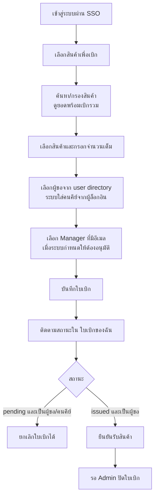

ข้อควรรู้

- ผู้ล็อกอินเป็น `createdBy` หรือคนคีย์ แต่สามารถเลือกผู้ขอ (`requester`) จากรายชื่อผู้ใช้ในระบบได้
- การยืนยันรับสินค้าให้สิทธิ์เฉพาะชื่อที่ตรงกับ `requester` ไม่ใช่คนคีย์
- Employee เห็นใบที่ตนเป็นผู้ขอหรือคนคีย์จาก API และหน้าจอเปิดตัวกรอง “เฉพาะของฉัน” อัตโนมัติ
- Employee ไม่มีสิทธิ์ดู Dashboard คลัง รับเข้า ประวัติภาพรวม หรือจัดการข้อมูลหลัก

### 3.2 Manager

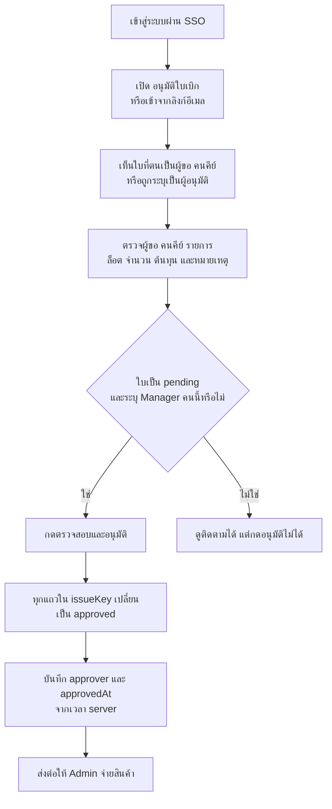

ขอบเขตข้อมูลของ Manager

- API ส่งรายการรับเข้า (`type=in`) ทั้งหมดให้ Manager
- ใบเบิกจะแสดงเฉพาะใบที่ Manager เป็นผู้ขอ คนคีย์ หรือผู้อนุมัติ
- Dashboard ของ Manager จึงคำนวณจากชุดข้อมูลที่ Manager มีสิทธิ์เห็น ไม่ควรตีความว่าเท่ากับ Dashboard ทั้งคลังของ Admin ในทุกกรณี
- Manager ไม่สามารถจ่ายสินค้า ปิดใบเบิก เปลี่ยนบทบาทผู้ใช้ หรือแก้ข้อมูลหลักสินค้า

### 3.3 Admin

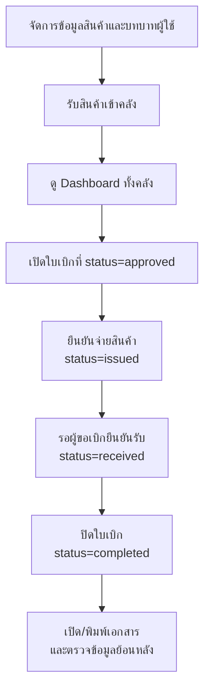

Admin ทำได้จริงในระบบปัจจุบัน

- เห็น `transactions` ทั้งหมด
- เพิ่ม แก้ไข เปิด/ปิดใช้งานสินค้า ตั้ง `min/max` และเปลี่ยนหมวดหมู่
- รับสินค้าเข้าคลังและสร้างสินค้า/หมวดใหม่จากฟอร์มรับเข้า
- จ่ายสินค้าเฉพาะใบที่อนุมัติแล้ว
- ปิดใบเมื่อผู้ขอยืนยันรับแล้ว
- ยกเลิกใบที่ยัง `pending` ได้ แต่ Admin ไม่ใช่ผู้อนุมัติใบเบิกแทน Manager
- เปิดเอกสารใบเบิกจากหน้าจัดการใบเบิกได้ตั้งแต่สถานะ `approved` เป็นต้นไป
- เปลี่ยนบทบาท Employee / Manager / Admin โดยระบบป้องกันไม่ให้ลดสิทธิ์ Admin คนสุดท้าย

## 4. Flow รับเข้าสินค้า

หน้ารับเข้าถูกบังคับสิทธิ์ทั้งหน้าและ API ให้ใช้ได้เฉพาะ `Admin`

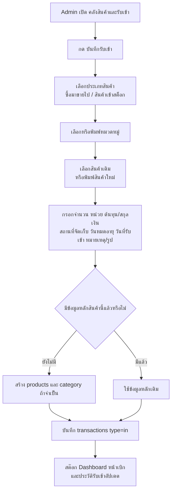

ข้อมูลที่บันทึกใน transaction รับเข้า

- สินค้า รหัส หมวด ประเภท หน่วย จำนวนเต็ม
- ราคา/ต้นทุนต่อหน่วยและสกุลเงิน
- สถานที่จัดเก็บเก็บอยู่ในฟิลด์ `requester` ของรายการรับเข้า
- วันที่รับเข้า วันหมดอายุ หมายเหตุ รูปสินค้า และเวลาที่ระบบบันทึก
- สถานที่จัดเก็บของรายการรับเข้าถูกนำไปแสดงในเอกสารใบเบิก โดยจับคู่สินค้าและวันหมดอายุ

พฤติกรรมสำคัญ

- Dropdown หมวดหมู่และสินค้าจะสัมพันธ์กับประเภทสินค้าที่เลือก และเปิดได้ทีละช่อง
- สินค้าที่ `isActive=false` จะไม่พร้อมให้รับเข้าใหม่หรือสร้างใบเบิกใหม่ แต่ประวัติเดิมไม่ถูกลบ
- ถ้าสร้างสินค้าใหม่จากหน้ารับเข้า ระบบจะสร้างข้อมูลใน `products` ก่อน แล้วจึงบันทึก `transactions type=in`
- ช่อง “วันที่ผลิต” มีอยู่บนฟอร์มปัจจุบัน แต่ค่าไม่ได้ถูกส่งไปเก็บใน transaction ตอนบันทึก จึงยังไม่ควรนำเสนอว่าเป็นข้อมูลที่ตรวจย้อนหลังได้

## 5. Flow เบิก–อนุมัติ–จ่ายสินค้า

### 5.1 การสร้างและจัดสรรล็อต

1. ระบบนำรับเข้าและเบิกที่ยังไม่ยกเลิกมาคำนวณยอดคงเหลือรายสินค้า/ล็อต
2. ผู้ใช้เลือกสินค้าและจำนวนที่ต้องการเบิก โดยจำนวนต้องเป็นจำนวนเต็มตั้งแต่ 1 ขึ้นไป
3. ระบบตรวจยอดรวม ถ้าไม่อนุญาตสต๊อกติดลบจะบันทึกเกินยอดไม่ได้
4. ระบบจัดสรรจากล็อตอัตโนมัติ ค่าเริ่มต้นคือ `FEFO` — หมดอายุก่อนออกก่อน; ถ้าไม่มีวันหมดอายุจะเรียงตามวันที่รับเข้า
5. หนึ่งสินค้าที่ต้องตัดหลายล็อตจะถูกสร้างเป็นหลาย `transactions` แต่ใช้ `issueKey` เดียวกัน
6. เมื่อบันทึกสำเร็จ ยอดพร้อมเบิกลดทันทีตั้งแต่สถานะ `pending`

### 5.2 สถานะใบเบิก

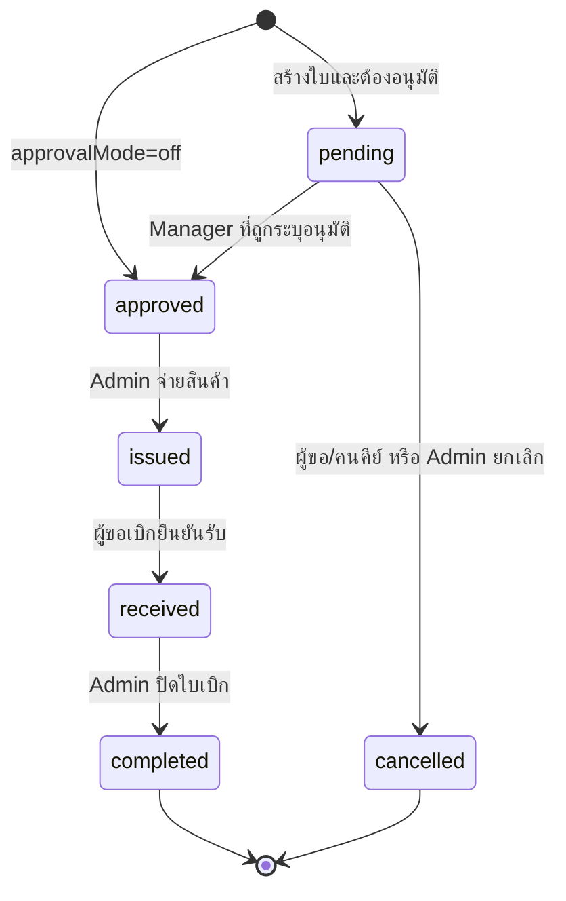

| สถานะ | ความหมายจริง | ผู้ทำรายการถัดไป |
| --- | --- | --- |
| `pending` | รอ Manager ที่ถูกเลือกอนุมัติ และสต๊อกถูกจองแล้ว | Manager / ผู้มีสิทธิ์ยกเลิก |
| `approved` | อนุมัติแล้ว รอจ่ายสินค้า | Admin |
| `issued` | Admin ยืนยันจ่ายแล้ว รอผู้ขอรับสินค้า | ผู้ขอ (`requester`) |
| `received` | ผู้ขอยืนยันรับแล้ว รอปิดงาน | Admin |
| `employee_confirmed` | สถานะเดิมที่ระบบยังรองรับ เทียบเท่า `received` | Admin |
| `completed` | ปิดใบเบิกขั้นสุดท้ายแล้ว | – |
| `cancelled` | ยกเลิกใบที่ยัง pending และคืนยอดจอง | – |

เมื่ออนุมัติ ระบบอัปเดตทุกแถวที่มี `issueKey` เดียวกัน

- `status = approved`
- `approver = ชื่อ Manager ที่กดอนุมัติ`
- `approvedAt = เวลาจาก server`

ค่าเริ่มต้นของระบบในโค้ดปัจจุบัน

| ค่า | ค่าเริ่มต้น | ผลต่อ flow |
| --- | --- | --- |
| `approvalMode` | `required` | ต้องเลือก Manager และรออนุมัติ |
| `allocationMode` | `fefo` | เลือกล็อตหมดอายุก่อน |
| `requireEmployeeConfirmation` | `true` | ต้องให้ผู้ขอยืนยันรับก่อน Admin ปิด |
| `allowNegativeStock` | `false` | ห้ามเบิกเกินยอดคงเหลือ |
| `issuePrefix` | `REQ` | เลขใบเบิกรูปแบบ `REQ-` ตามด้วยเลขท้ายจากเวลา |
| `receivePrefix` | `IN` | prefix เลขเอกสารรับเข้าในหน้าประวัติ |

> API รองรับ `issued → completed` เมื่อปิดการยืนยันรับ แต่ปุ่มบนหน้าจัดการปัจจุบันแสดง “ปิดใบเบิก” หลัง `received/employee_confirmed` เท่านั้น ดังนั้น flow ที่ใช้งานผ่าน UI ปัจจุบันควรนำเสนอเป็น `issued → received → completed`

## 6. Flow อีเมล

ระบบมีอีเมล 2 ชุด และการส่งอีเมลไม่ย้อนการบันทึกใบเบิกหรือสถานะที่สำเร็จไปแล้ว

### 6.1 อีเมลขออนุมัติ

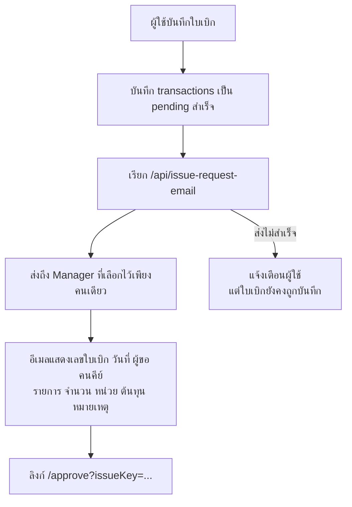

อีเมลชุดนี้ส่งเฉพาะเมื่อ `approvalMode` ไม่ใช่ `off` และผู้อนุมัติต้องเป็นผู้ใช้บทบาท Manager ที่มีอีเมล

### 6.2 อีเมลแจ้งเปลี่ยนสถานะ

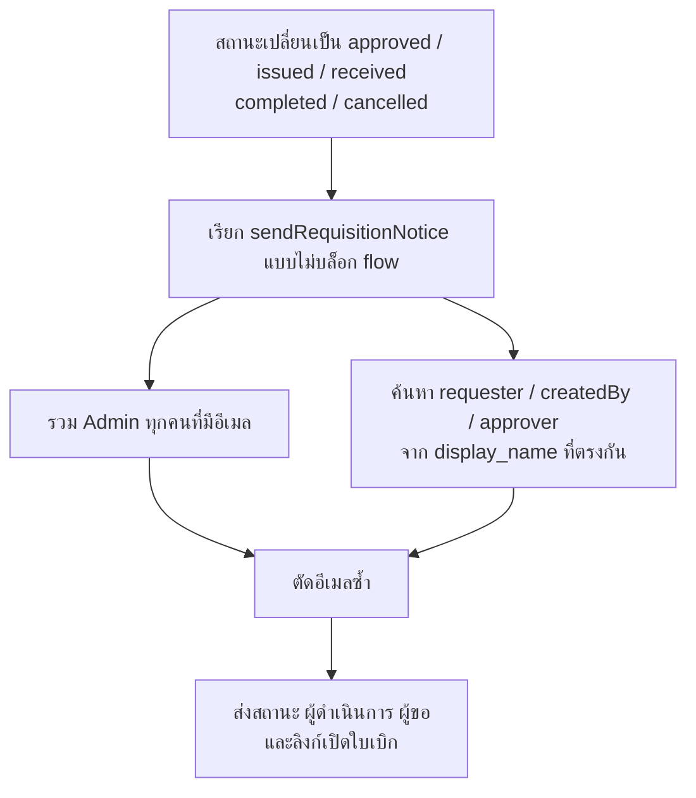

กรณี `approvalMode=off` ใบจะถูกสร้างเป็น `approved` และระบบส่ง notice ชุดที่สอง โดยไม่ส่งอีเมลขออนุมัติชุดแรก

เงื่อนไข SMTP

- ต้องมี `MAIL_HOST`, `MAIL_USERNAME`, `MAIL_PASSWORD`
- ผู้ส่งใช้ `MAIL_FROM_ADDRESS` หรือ fallback เป็น `MAIL_USERNAME`
- `MAIL_PORT`, `MAIL_ENCRYPTION`, `MAIL_FROM_NAME` เป็นค่าประกอบ
- ถ้า SMTP ไม่พร้อม การรับเข้า การสร้างใบเบิก และการเปลี่ยนสถานะในฐานข้อมูลยังทำงานต่อได้

## 7. Dashboard ใช้ดูอะไร

Dashboard เปิดให้ `Manager` และ `Admin` โดย Admin เป็นมุมมองที่ครบทั้งคลัง ส่วน Manager เป็นมุมมองจากข้อมูลที่สิทธิ์ของ Manager คนนั้นเข้าถึง

ผู้ใช้เลือกช่วงวันที่ได้ โดยค่าเริ่มต้นตั้งแต่วันแรกของเดือนปัจจุบันถึงวันนี้

### KPI หลัก

| KPI | วิธีอ่าน |
| --- | --- |
| สินค้าในคลัง | จำนวนรายการสินค้า active ที่มีประวัติความเคลื่อนไหว ไม่ใช่ผลรวมจำนวนหน่วย |
| รับเข้าวันนี้ | ผลรวม `quantity` ของแถวรับเข้าในวันที่ปลายช่วง |
| เบิกจ่ายวันนี้ | ผลรวม `quantity` ของแถวเบิกในวันที่ปลายช่วง |
| ต่ำกว่ากำหนด | จำนวนสินค้าที่คงเหลือต่ำกว่า `minStock` |
| ใกล้หมด/หมดอายุ | จำนวนสินค้าคงเหลือที่มีวันหมดอายุอยู่ภายในจำนวนวันเตือน ค่าเริ่มต้น 90 วัน |

### กราฟและรายการประกอบ

- กราฟ `รับเข้า / เบิกจ่าย (จำนวนรายการ)` นับจำนวนแถว transaction ต่อวัน ไม่ใช่จำนวนหน่วยและไม่ใช่จำนวนใบเบิก
- ถ้าสินค้าหนึ่งรายการถูกจัดสรรจาก 2 ล็อต กราฟฝั่งเบิกอาจนับเป็น 2 รายการ แม้อยู่ในใบเบิกเดียว
- กราฟเบิกจ่ายไม่นับแถวสถานะ `cancelled`
- กราฟ `สถานะสต๊อก` แบ่งเป็น ปกติ, ต่ำกว่า min, สูงกว่า max และยังไม่ตั้งค่า min/max
- รายการเติมสต๊อกแสดงสินค้าต่ำกว่า min; ระบบมีรายการสินค้าสูงกว่า max แยกให้ตรวจสอบ
- ตารางสต๊อกรายสินค้าแสดงรับเข้า เบิกจ่าย คงเหลือ min/max และสถานะ
- ตารางใบเบิกรออนุมัติรวมรายการตาม `issueKey`
- รายการรับเข้ามากและเบิกบ่อยช่วยดูความเคลื่อนไหว โดยจัดอันดับจากจำนวนแถวก่อน แล้วจึงดูจำนวนรวม

ตัวอย่างการอ่าน

- รับสินค้า A ครั้งเดียว 54 หน่วย: KPI รับเข้าวันนี้เพิ่ม 54 แต่กราฟเพิ่ม 1 รายการ
- ใบเบิกเดียวมีสินค้า A จาก 2 ล็อต: ยอดจำนวนรวมเป็นจำนวนที่ขอ แต่กราฟอาจเพิ่ม 2 รายการ
- การสร้างใบ `pending` ทำให้ยอดคงเหลือพร้อมเบิกลดทันที เพราะระบบนับเป็นสต๊อกที่จองแล้ว

ข้อสังเกตของ Dashboard ปัจจุบัน

- KPI `เบิกจ่ายวันนี้` รวมแถว `type=out` ตามวันที่โดยตรง ขณะที่กราฟตัด `cancelled` ออก จึงอาจเห็น KPI กับกราฟไม่สอดคล้องกันเมื่อมีใบถูกยกเลิกในวันเดียวกัน
- สินค้าที่ปิดใช้งานถูกซ่อนจาก Dashboard และหน้าเลือกสินค้า แต่ธุรกรรมเดิมยังอยู่ในฐานข้อมูล

## 8. เอกสารใบเบิกและการพิมพ์

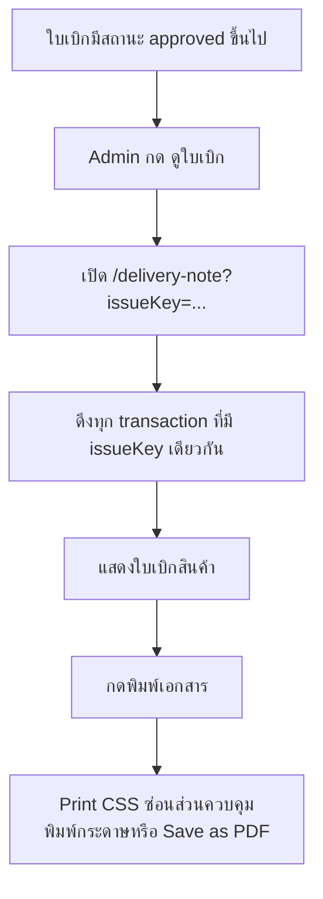

หน้าจัดการใบเบิกแสดงปุ่ม `ดูใบเบิก` ให้ Admin เท่านั้น และไม่แสดงในสถานะ `pending` หรือ `cancelled` ส่วน URL เอกสารยอมรับสถานะ `approved`, `issued`, `received`, `employee_confirmed` และ `completed`

ข้อมูลบนเอกสาร

- เลขใบเบิก (`issueKey`) และวันที่รายการ
- ผู้ขอ ผู้อนุมัติ และคนคีย์ใบเบิก
- รายการสินค้า จำนวน หน่วย และสถานที่จัดเก็บ
- หมายเหตุ
- ช่องลงนามผู้จัดของ/แอดมิน ผู้รับสินค้า วันที่รับ และผู้ปิดใบเบิก

## 9. จุดข้อมูลที่เชื่อมกัน

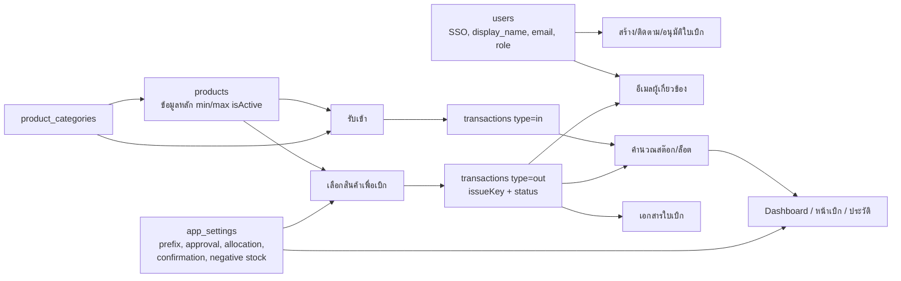

| แหล่งข้อมูล | เชื่อมไปใช้อะไร |
| --- | --- |
| `users` | Session จาก SSO, บทบาท, รายชื่อผู้ขอ, Manager ที่เลือกอนุมัติ และอีเมลผู้เกี่ยวข้อง |
| `products` | ข้อมูลหลักสินค้า SKU ประเภท หมวด หน่วย ต้นทุน min/max สถานที่จัดเก็บเริ่มต้น วันหมดอายุเริ่มต้น และ `isActive` |
| `product_categories` | รายชื่อหมวดหมู่ และเมื่อเปลี่ยนชื่อหมวด ระบบอัปเดตทั้ง `products` และ `transactions` |
| `transactions` | ข้อมูลที่ใช้จริงสำหรับรับเข้า เบิก สถานะ ต้นทุน วันหมดอายุ สถานที่จัดเก็บ และคำนวณสต๊อก |
| `app_settings` | prefix เอกสาร วิธีอนุมัติ วิธีจัดสรรล็อต การยืนยันรับ การอนุญาตสต๊อกติดลบ และจำนวนวันเตือนหมดอายุ |

คีย์เชื่อมที่ควรอธิบายบนสไลด์

- `issueKey` รวมหลายสินค้า/หลายล็อตให้เป็นใบเบิกเดียว
- สินค้าเชื่อมกันด้วย `productImportType + name + sku + unit`; ถ้ามี SKU ระบบใช้ SKU ช่วยจับคู่กับข้อมูลหลัก
- ล็อตที่ระบบใช้งานในหน้าจอเกิดจากสินค้าเดียวกันและวันหมดอายุเดียวกัน แล้วเรียงตามวันที่รับเข้า/วันหมดอายุ
- `requester` ของ `type=out` หมายถึงผู้ขอเบิก แต่ `requester` ของ `type=in` ถูกใช้เป็นสถานที่จัดเก็บ
- `createdBy` คือผู้ล็อกอินที่คีย์ใบเบิก
- `approver` และ `approvedAt` ระบุผู้อนุมัติและเวลาอนุมัติ
- `isActive=false` ซ่อนสินค้าจากงานใหม่โดยไม่ลบประวัติ
- Dashboard และยอดพร้อมเบิกไม่ได้มีตารางยอดคงเหลือแยก แต่คำนวณจาก `transactions`

## 10. Script สั้นสำหรับพูดนำเสนอหน้าเวที

สวัสดีครับ วันนี้จะนำเสนอระบบ **CPAC SB&M Inventory Management** ซึ่งดูแล flow สินค้าตั้งแต่รับเข้าคลัง ไปจนถึงการเบิก อนุมัติ จ่ายสินค้า ยืนยันรับ และปิดใบเบิก

ระบบแบ่งผู้ใช้เป็น 3 บทบาท คือ Employee, Manager และ Admin ทุกบทบาทสามารถสร้างใบเบิกได้ Employee ใช้ติดตามใบที่เกี่ยวข้องกับตนและยืนยันรับสินค้า Manager อนุมัติเฉพาะใบที่ถูกระบุชื่อตน ส่วน Admin ดูแลข้อมูลสินค้า รับสินค้าเข้า จ่ายสินค้า ปิดใบเบิก และดูภาพรวมทั้งคลัง

เมื่อ Admin รับสินค้าเข้า ระบบจะบันทึกข้อมูลสินค้า จำนวน ต้นทุน สถานที่จัดเก็บ วันที่รับเข้า และวันหมดอายุลงในฐานข้อมูล จากนั้นยอดสต๊อก หน้าเลือกสินค้า และ Dashboard จะอัปเดตจากข้อมูลชุดเดียวกัน

ตอนสร้างใบเบิก ผู้ใช้เลือกสินค้า จำนวน ผู้ขอ และ Manager ผู้อนุมัติ ระบบจะจัดสรรล็อตอัตโนมัติแบบ FEFO คือของที่หมดอายุก่อนจะถูกเลือกก่อน และสร้างเลข `issueKey` เพื่อรวมทุกสินค้าและทุกล็อตไว้ในใบเดียวกัน จุดสำคัญคือยอดพร้อมเบิกจะลดทันทีตั้งแต่ใบอยู่ในสถานะรออนุมัติ เพราะระบบถือว่าเป็นการจองสต๊อก และถ้ายกเลิกใบ ระบบจะคืนยอดจองกลับมา

หลังจากนั้น Manager ที่ถูกเลือกจะตรวจสอบและอนุมัติ ระบบบันทึกชื่อและเวลาอนุมัติให้ทุกแถวในใบเดียวกัน แล้วส่งต่อให้ Admin ยืนยันจ่ายสินค้า ผู้ขอเบิกจึงกดยืนยันรับ และ Admin ปิดใบเบิกเป็นขั้นตอนสุดท้าย ทุกครั้งที่สถานะเปลี่ยน ระบบจะพยายามส่งอีเมลแจ้ง Admin และผู้เกี่ยวข้องโดยอัตโนมัติ

Dashboard ช่วยตอบคำถามหลักของคลัง เช่น วันนี้รับเข้าและเบิกกี่หน่วย สินค้าใดต่ำกว่า min สูงกว่า max หรือใกล้หมดอายุ และมีใบใดรออนุมัติ โดย KPI แสดงจำนวนหน่วย ส่วนกราฟรับเข้า–เบิกจ่ายนับจำนวนแถวรายการ จึงช่วยให้เห็นทั้งปริมาณและความถี่ของการเคลื่อนไหว

ข้อมูลทั้งหมดเชื่อมกันผ่าน `users`, `products`, `transactions` และ `app_settings` โดย `transactions` เป็นแกนหลักในการคำนวณสต๊อก ส่วน `issueKey` ใช้ตรวจสอบย้อนหลังว่าใบหนึ่งมีสินค้าอะไร ใครคีย์ ใครอนุมัติ และอยู่ในขั้นตอนไหน เมื่อใบได้รับอนุมัติแล้ว Admin ยังสามารถเปิดเอกสารใบเบิกและพิมพ์เป็น PDF ได้

สรุปคือ ระบบนี้ช่วยรวมงานรับเข้า เบิก อนุมัติ จ่าย และติดตามสถานะไว้ใน flow เดียว ลดการคีย์ซ้ำ ทำให้ยอดพร้อมใช้ชัดเจน และตรวจสอบย้อนหลังได้ครับ

## 11. โครงสไลด์แนะนำ

1. ชื่อระบบและปัญหาที่ต้องการแก้
2. ภาพรวมระบบตั้งแต่รับเข้าถึงปิดใบเบิก
3. บทบาท Employee / Manager / Admin
4. Flow รับสินค้าเข้า
5. Flow สร้างใบเบิกและการจองสต๊อก
6. Flow อนุมัติ–จ่าย–ยืนยันรับ–ปิดใบ
7. การจัดสรรล็อต FEFO/FIFO
8. Flow อีเมล
9. Dashboard ใช้ดูอะไร และวิธีอ่าน KPI/กราฟ
10. จุดข้อมูลที่เชื่อมกัน
11. เอกสารใบเบิกและการตรวจสอบย้อนหลัง
12. สรุปประโยชน์และข้อสังเกตของระบบปัจจุบัน

## 12. Keyword สำหรับใส่สไลด์

- End-to-end inventory and requisition flow
- Role-based access: Employee / Manager / Admin
- Reserve stock immediately at request creation
- Assigned Manager approval
- Automatic FEFO/FIFO lot allocation
- Issue–Receive–Close workflow
- Email notification to related users
- Dashboard from transaction data
- Min/Max and expiry monitoring
- Traceability with `issueKey`
- Hide inactive products without deleting history
- Printable requisition document / PDF

## 13. ข้อสังเกตของระบบปัจจุบันก่อนนำเสนอ Demo

- ใช้บัญชี Admin สาธิตหน้ารับเข้าและ Dashboard ทั้งคลัง; เมนูรับเข้าจะแสดงเฉพาะ Admin
- ใช้ Manager ที่ถูกเลือกไว้ในใบเพื่อสาธิตปุ่มอนุมัติ เพราะ Manager คนอื่นอนุมัติแทนไม่ได้
- ใช้บัญชีที่ชื่อเดียวกับ `requester` เพื่อสาธิตปุ่มยืนยันรับสินค้า
- อย่าสาธิต “วันที่ผลิต” เป็นข้อมูลย้อนหลัง เพราะหน้าฟอร์มยังไม่ได้บันทึกค่านี้
- ถ้าจะสาธิต flow ไม่ต้องยืนยันรับ ต้องปรับ UI เพิ่มก่อน; flow ที่พร้อมสาธิตปัจจุบันคือ `pending → approved → issued → received → completed`
- ถ้าสาธิตการยกเลิกในวันเดียวกัน ให้ระวัง KPI เบิกจ่ายวันนี้อาจยังรวมจำนวนที่ยกเลิก แม้กราฟและยอดคงเหลือจะตัดรายการยกเลิกออกแล้ว
